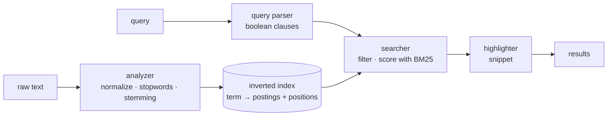

# farol

A full-text search engine written in Rust from first principles — no Lucene, no
Tantivy, no search dependency. Text analysis, a positional inverted index with
delta+varint compressed blocks, BM25 ranking, block-max WAND dynamic pruning, a
memory-mapped index format, and live reindexing that never blocks a query — in
roughly 4,500 lines of Rust, checked by tests, `loom` and Miri.

[](https://github.com/digomes87/farol/actions/workflows/ci.yml)


```console
$ farol index ./corpus
7 document(s) indexed in 0.02s → farol.idx

$ farol search '+positions "exact phrase"'
2 result(s) in 0.1 ms

 1. Phrases and positions  2.713
    corpus/phrases-and-positions.md
    # Phrases and positions Exact phrase search verifies adjacency. Each term of
    the phrase carries an offset relative to its beginning…

 2. The inverted index  2.224
    corpus/inverted-index.md
    …stores the position of each occurrence. Without positions there is no way to
    answer an exact phrase query…
```

## Why it exists

Search looks simple until you try. Matching words is easy; the hard part is
deciding which of the matching documents is the right answer, and explaining
that decision to the reader. This project implements the whole path — from
accent folding to the highlighted excerpt — to expose those decisions instead of
hiding them behind a library.

## Install

```bash
git clone https://github.com/digomes87/farol
cd farol
cargo install --path crates/cli   # installs the `farol` binary
```

Or, without installing:

```bash
cargo run -p farol-cli --release -- search "bm25"
```

## Usage

```bash
farol index ./docs                    # index a directory recursively
farol index ./docs --ext md,txt       # restrict to certain extensions
farol index ./docs --no-stemming      # index words exactly as written

farol search "search engine"          # query
farol search '+rust -java' -n 20      # required and excluded, 20 results
farol search 'bm25' --json | jq       # output for another program
farol search 'bm25' --k1 1.6 --b 0.3  # tune the ranking

farol search 'bm25 ranking' --explain # show how the query was evaluated

farol repl                            # interactive session, index kept in memory
farol stats                           # index counters
```

### Query syntax

| Syntax | Meaning |
|--------|---------|
| `rust search` | either term may match; documents with both rank higher |
| `+rust` | the document **must** contain the term |
| `-java` | the document **must not** contain the term |
| `"search engine"` | the words must be adjacent, in this order |
| `+"search engine"` | …and the phrase is mandatory |

Queries and documents go through the same analyzer, so `"Migrações"` finds a
text that says `migracao`.

## How it works



Every stage is a module with a single responsibility:

| Module | Responsibility |
|--------|----------------|
| `analyzer` | text → normalized terms, with position and source offset |
| `index` | term → sorted posting list, with positions and document lengths |
| `query` | query string → `Must` / `Should` / `MustNot` clauses |
| `searcher` | clauses + index → ranked documents, exhaustive or pruned |
| `bm25` | postings → relevance score |
| `codec` | delta + varint compression of posting lists |
| `cursor` | block-skipping iteration over a compressed posting list |
| `topk` | bounded collector for the best k hits |
| `snippet` | matched document → highlighted excerpt |
| `store` | index ↔ a single self-describing file |
| `mmap` | index ↔ a file read in place, without loading it |
| `source` | one interface over in-memory and mapped indexes |
| `snapshot` | lock-free publication of a new index to live readers |
| `service` | a search engine that can be rebuilt while it serves |
| `engine` | the façade tying it all together |

The reasoning behind each design decision is in
[`docs/ARCHITECTURE.md`](docs/ARCHITECTURE.md).

## Compressed blocks

Posting lists are sorted, so `farol` stores the gaps between document ids rather
than the ids themselves, and spends one byte per seven bits of magnitude
(LEB128). Lists are cut into blocks of 128 postings, each block carrying its
last document id and its own score bounds.

```console
$ farol stats
postings size   1757.0 KiB (3.06 bytes/posting)
```

On a 5,000 document corpus the index file drops from 15.4 MB to 7.9 MB. The
block layout is not only about size: `last_doc` lets a query skip a whole block
by comparing one integer, and the per-block bounds are what the pruning below
uses.

## Dynamic pruning (block-max WAND)

Scoring every matching document to show ten of them is wasted work. For queries
of optional terms, `farol` runs **block-max WAND**: it keeps one cursor per
term, tracks the score of the tenth best document found so far, and uses score
bounds to prove that entire stretches of the posting lists cannot beat it. Those
documents are skipped without being scored, and whole blocks are skipped without
being decoded.

```console
$ farol search "term0 term1 term2" --explain -n 5
strategy: wand (dynamic pruning) · candidates: 813 · scored: 104 · skipped: 709 (87% avoided)
```

The bounds come from the index itself: for every term, and again for every
block, it stores the highest frequency and the shortest document length among
those postings. BM25 grows with frequency and shrinks with length, so that pair
bounds the term's contribution — and the bound holds for every `k1`/`b`, which
is why it survives runtime tuning of the ranking. Per-block bounds are much
tighter than per-term ones, because a block spans a narrow slice of the
collection.

Queries with required, excluded or phrase clauses fall back to exhaustive
evaluation: those clauses already constrain the candidate set, usually harder
than pruning would.

Both strategies return the same ranking, and that is enforced by tests rather
than assumed — see `pruning_and_exhaustive_scoring_return_the_same_ranking` in
[`crates/core/src/searcher.rs`](crates/core/src/searcher.rs). `--pruning` can be
turned off through the library API (`Searcher::with_pruning`) to A/B the two.

## Performance

`cargo bench`, synthetic corpus with a Zipf-like term distribution
(5,000 documents × 120 terms, 4,000 term vocabulary), Apple M3 Max:

| Operation | Time |
|-----------|------|
| Index 5,000 documents | 110 ms |
| Rare term query | 34 ns |
| Frequent term query | 20 µs |
| Two optional terms (union) | 43 µs |
| Two required terms (intersection) | **10 µs** |
| Two term phrase | 2.4 µs |

Same query, same candidate set, pruning on and off:

| Query | Exhaustive | Block-max WAND | Speedup |
|-------|-----------|----------------|---------|
| `term0 term1` | 45.0 µs | **14.4 µs** | 3.1× |
| `term0 term1 term2 term3` | 93.0 µs | **37.3 µs** | 2.5× |

Two effects are worth separating. The union/intersection pair in the first table
shows the value of choosing candidates from the required clauses — the same
query with `+` costs 4× less. The table above shows what pruning buys on top of
that for queries where no such clause exists.

## Opening an index without loading it

`farol index` writes a layout meant to be read in place: fixed-size records and
section offsets, a term dictionary sorted for binary search, and posting bytes
identical to the in-memory ones. Opening it is an `mmap` call and a header
check — the operating system pages in only what a query touches.

Answering one query from a cold start, on an 80 MB index over 40,000 documents:

| Format | Time to first result | Peak memory |
|--------|---------------------|-------------|
| memory-mapped | **2.8 ms** | **6.7 MB** |
| serialized (`--serialized`) | 39.9 ms | 190.3 MB |

Reading picks the format from the file itself, so both keep working and no flag
has to be remembered. A mapped index is read-only; indexing into one reports
that rather than failing obscurely.

## Rebuilding under load

Reindexing is minutes of work; a query is microseconds. `SearchService` builds
the new index beside the live one and publishes it with a single pointer swap,
so queries are answered from the current generation throughout — including
during the rebuild.

```console
$ farol repl --watch ./docs --every 10
[gen 1] › goroutines
no results for `goroutines`
                          ← a background rebuild picks up a new document
[gen 2] › goroutines
 1. Go  0.693
    # Go go ships goroutines
```

A query that started before the swap finishes against the generation it started
with: it holds an `Arc` to that version, so the old index stays alive exactly as
long as someone is still reading it.

The read path never takes a lock a writer can hold. The interesting part is the
window between loading the pointer and bumping its reference count — a writer
can swap and release the last reference in between, which is undefined
behaviour, not merely a stale read. The first version guarded that with an
atomic reader counter, and `loom` rejected it: the argument has the shape of
Dekker's algorithm and holds only if the swap and the counter read share one
total order. That is true of `SeqCst` on real hardware, but it is not something
a reviewer can check in four lines. The argument was replaced instead of
defended — readers hold a shared guard across load-and-increment, and superseded
values are dropped only under `try_write`, whose success *is* the proof that no
reader is inside. See [`crates/core/src/snapshot.rs`](crates/core/src/snapshot.rs).

## Type-state

An index that is still accepting documents cannot answer queries: its postings
are staged, unsorted and without score bounds. That used to be a rule you had to
remember, and it was forgotten at least once in this repo's own history.

It is now a type parameter. `Index<Building>` has `add`/`merge` and no readers;
`Index<Sealed>` has readers and no writers; `seal()` and `edit()` consume the
index to move between them. Getting it wrong is a compile error, pinned by
`compile_fail` doc tests:

```rust
let mut index = Index::new(Analyzer::default());
index.add("a", "A", "rust");
index.doc_freq("rust");     // error: no method `doc_freq` on Index<Building>
```

## Development

```bash
cargo test --workspace      # 167 tests: unit, doc, relevance and end-to-end
cargo bench -p farol-core   # criterion benchmarks
cargo clippy --workspace --all-targets -- -D warnings
cargo fmt --all --check

# every interleaving of the concurrent snapshot cell
RUSTFLAGS="--cfg loom" cargo test -p farol-core --lib snapshot --release

# undefined behaviour in the unsafe code, with strict provenance
MIRIFLAGS="-Zmiri-strict-provenance" cargo +nightly miri test -p farol-core --lib -- snapshot:: codec:: index::
```

All four run in CI.

### Are the tests real?

A suite that only exercises fixtures rots: the numbers in it stop describing
anything and start describing themselves. Two habits keep this one honest.

**Most assertions compare two implementations, not a recorded value.** Pruned
search against exhaustive scoring, the galloping skip against a linear scan, the
mapped index against the in-memory one, `stem(stem(x))` against `stem(x)`. Those
stay meaningful no matter how the sample corpus changes, and they have caught
real bugs: two in block-max WAND, one in the snapshot cell (found by loom), and
the missing `finish()` that became the type-state.

**The rest is measured with mutation testing.** `cargo mutants` rewrites the
code — flips a comparison, replaces a return value — and reports which changes
no test noticed:

```bash
cargo mutants -p farol-core --file crates/core/src/bm25.rs
```

It is not run in CI (it takes minutes per module), but it is how the weak spots
above were found. The last sweep of the ranking and cursor modules left eleven
survivors, all of the same kind: tests that pinned a *direction* rather than a
*value*, so mutating the arithmetic inside BM25 kept "rarer terms score higher"
true while the formula was wrong. They are now pinned against the formula
written out independently in the test.

The tests in [`crates/core/tests/relevance.rs`](crates/core/tests/relevance.rs)
pin which document must rank first for realistic queries over the sample corpus.
They are the safety net against the worst kind of search regression: the one
where everything still compiles, every unit test still passes, and the results
quietly get worse.

## Known limitations

- Indexing rewrites the whole index; there is no incremental update and no
  document deletion. Searching a mapped index does not load it, but building one
  still holds it in memory.
- The original text is stored inside the index to support snippets, which
  roughly doubles the size on disk.
- The stemmer is heuristic and covers Portuguese and English; other languages
  pass through nearly untouched.
- There is no prefix search, no field search and no typo tolerance.

## License

MIT.
