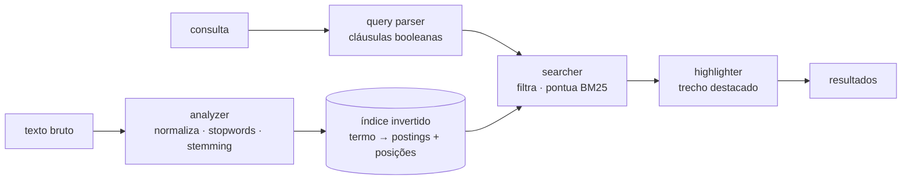

# farol

Motor de busca full-text escrito em Rust, do zero — sem Lucene, sem Tantivy, sem
dependência de busca. Analisador de texto, índice invertido posicional,
ranqueamento BM25, consultas booleanas com frase exata e trechos destacados,
tudo em ~2.000 linhas de Rust com testes.

[](https://github.com/digomes87/farol/actions/workflows/ci.yml)


```console
$ farol index ./corpus
7 documento(s) indexado(s) em 0.01s → farol.idx

$ farol search '+posições "frase exata"'
2 resultado(s) em 0.1 ms

 1. Frases e posições  2.713
    corpus/frases-e-posicoes.md
    # Frases e posições A busca por frase exata verifica adjacência. Cada termo
    da frase tem um deslocamento relativo ao início dela…

 2. Índice invertido  2.262
    corpus/indice-invertido.md
    …guarda também as posições de cada ocorrência. Sem elas não é possível
    responder a uma consulta de frase exata…
```

## Por que existe

Busca parece simples até você tentar. Casar palavras é fácil; o difícil é
decidir qual dos documentos que casaram é a resposta certa, e explicar isso ao
leitor. Este projeto implementa o caminho inteiro — da normalização de acentos
ao trecho destacado — para expor essas decisões em vez de escondê-las atrás de
uma biblioteca.

## Instalação

```bash
git clone https://github.com/digomes87/farol
cd farol
cargo install --path crates/cli   # instala o binário `farol`
```

Ou, sem instalar:

```bash
cargo run -p farol-cli --release -- search "bm25"
```

## Uso

```bash
farol index ./docs                    # indexa um diretório recursivamente
farol index ./docs --ext md,txt       # só certas extensões
farol index ./docs --no-stemming      # indexa as palavras como escritas

farol search "motor de busca"         # consulta
farol search '+rust -java' -n 20      # obrigatório e excluído, 20 resultados
farol search 'bm25' --json | jq       # saída para outro programa
farol search 'bm25' --k1 1.6 --b 0.3  # ajuste do ranqueamento

farol repl                            # sessão interativa, índice na memória
farol stats                           # contadores do índice
```

### Sintaxe de consulta

| Sintaxe | Significado |
|---------|-------------|
| `rust busca` | qualquer um dos termos casa; quem tem os dois ranqueia acima |
| `+rust` | o documento **precisa** conter o termo |
| `-java` | o documento **não pode** conter o termo |
| `"motor de busca"` | as palavras precisam estar adjacentes, nessa ordem |
| `+"motor de busca"` | …e a frase é obrigatória |

Consulta e documento passam pelo mesmo analisador, então `"Migrações"` encontra
um texto que diz `migracao`.

## Como funciona



Cada estágio é um módulo com uma responsabilidade só:

| Módulo | Responsabilidade |
|--------|------------------|
| `analyzer` | texto → termos normalizados, com posição e offset de origem |
| `index` | termo → lista de postings ordenada, com posições e tamanho dos documentos |
| `query` | string de consulta → cláusulas `Must` / `Should` / `MustNot` |
| `searcher` | cláusulas + índice → documentos ranqueados |
| `bm25` | postings → pontuação de relevância |
| `snippet` | documento casado → trecho destacado |
| `store` | índice ↔ arquivo único autodescritivo |
| `engine` | fachada que amarra tudo |

O detalhamento das decisões de projeto está em
[`docs/ARCHITECTURE.md`](docs/ARCHITECTURE.md).

## Desempenho

`cargo bench`, corpus sintético com distribuição Zipf de termos
(5.000 documentos × 120 termos, vocabulário de 4.000), Apple M3 Max:

| Operação | Tempo |
|----------|-------|
| Indexar 5.000 documentos | 110 ms |
| Consulta de termo raro | 34 ns |
| Consulta de termo frequente | 20 µs |
| Dois termos opcionais (união) | 43 µs |
| Dois termos obrigatórios (interseção) | **10 µs** |
| Frase de dois termos | 2,4 µs |

A linha que importa é o par união/interseção: a mesma consulta com `+` custa
4× menos, porque o conjunto de candidatos sai da interseção das listas
obrigatórias e o BM25 roda sobre bem menos documentos.

## Desenvolvimento

```bash
cargo test --workspace      # 87 testes: unitários, doc-tests, relevância e ponta a ponta
cargo bench -p farol-core   # benchmarks com criterion
cargo clippy --workspace --all-targets -- -D warnings
cargo fmt --all --check
```

Os testes de [`crates/core/tests/relevance.rs`](crates/core/tests/relevance.rs)
fixam qual documento deve ficar em primeiro lugar para consultas reais sobre o
corpus de exemplo. Eles são a rede de proteção contra o pior tipo de regressão
em busca: aquela em que tudo continua compilando, todos os testes unitários
passam, e os resultados pioram.

## Limitações conhecidas

- O índice inteiro vive em memória e é reescrito a cada indexação; não há
  atualização incremental nem exclusão de documentos.
- O texto original é guardado dentro do índice para permitir os trechos
  destacados, o que dobra o espaço em disco.
- O stemmer é heurístico e cobre português e inglês; outras línguas passam
  praticamente sem alteração.
- Não há busca por prefixo, por campo nem tolerância a erro de digitação.

## Licença

MIT.
